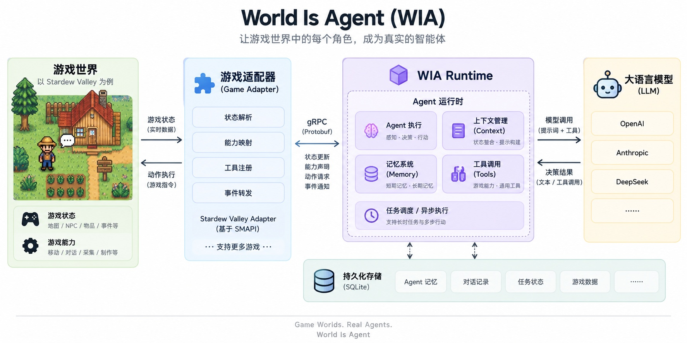

# World Is Agent

**World Is Agent（WIA）** 是一个开源的游戏原生 Agent Runtime。游戏通过 Adapter 上报事件与环境观察，Runtime 为游戏角色提供身份、上下文、记忆、模型决策和受约束的工具执行能力。



## 包含内容

- 基于 Go 的 Runtime，提供 gRPC 双向流和本地 Web 控制台。
- Protocol v1alpha2，定义事件、观察、能力、动作和回合完成协议。
- 按游戏、世界和实体隔离的持久化记忆，以及 JSONL 回合 Trace。
- 与模型服务商解耦的接口，当前支持 DeepSeek 和 OpenAI。
- 内置 `stardew-valley` 与 `rimworld` Game Profile、Prompt 和 Definitions。

一个 Runtime 进程同一时间加载一个 Game Profile。当前游戏的多个 Adapter 可以作为独立 Environment Session 连接；其它游戏的 Adapter 会在环境就绪和能力发现之前被拒绝。

## 快速开始

构建 Windows 便携版 Runtime：

```powershell
.\scripts\release-runtime.ps1
```

解压 `dist\world-is-agent-v<version>-windows-amd64.zip`，运行 `wia-runtime.exe`，然后在自动打开的 Web 控制台中完成配置：

1. 选择 Stardew Valley 或 RimWorld。Runtime 会在数据目录中准备缺失的内置 Profile 文件。
2. 根据页面提示配置模型服务商和 API Key。
3. 等待状态变为 **Ready**，再启动对应的游戏和 Adapter。

**Switch game（切换游戏）** 会在当前 Runtime 进程中应用另一个 Game Profile，取消正在执行的回合并保留已有历史记录，随后由对应 Adapter 自动重连。**Model settings（模型设置）** 可以修改服务商、模型、API Key 和可选的 Base URL；新配置通过连通性检查后才会生效。

自动重连需要 Stardew Adapter 0.1.1 或 RimWorld Adapter 0.1.0。Runtime 发布包不包含游戏 Adapter，请从独立的 [world-is-agent-adapters](https://github.com/zlci7/world-is-agent-adapters) 仓库构建并安装。详细步骤参见[官方 Adapter](docs/development/guide.md#official-adapters)。

开发环境可以运行：

```powershell
.\scripts\start-runtime.ps1
```

脚本优先使用 `WIA_DATA_ROOT` 指定的数据目录，否则使用 `runtime/.local/runtime-data`，并且不会自动选择游戏。更多信息参见[开发指南](docs/development/guide.md)。

## 技术栈

`Golang` · `gRPC` · `Protobuf` · `SQLite` · `C#` · `SMAPI` · `LLM Tool Calling` · `JSON Schema`

## 仓库结构

```text
runtime/      Runtime、内置 Game Profile、Prompt 和 Definitions
protocol/     Protobuf 协议与生成代码
console/      本地 Web 控制台
docs/         架构、状态、开发指南和历史文档
```

本仓库负责 Runtime、Console、Protocol 和 Runtime 内置的 Game Profile。官方游戏 Adapter 位于独立的 [world-is-agent-adapters](https://github.com/zlci7/world-is-agent-adapters) 仓库。

## 文档

- [系统架构](ARCHITECTURE.md)
- [当前状态](docs/STATUS.md)
- [开发指南](docs/development/guide.md)
- [测试与验收](docs/development/testing.md)
- [文档索引](docs/README.md)

## 当前状态

Runtime 已支持 Game Profile 选择、多游戏启动、运行时切换游戏和模型配置，官方 Stardew Valley 与 RimWorld Adapter 已拆分到独立仓库。两个游戏的基础实机闭环已经通过；运行时切换游戏、自动重连和修改模型仍需在正式发布前完成一次聚焦实机验收。

## 许可证

[MIT License](LICENSE)
