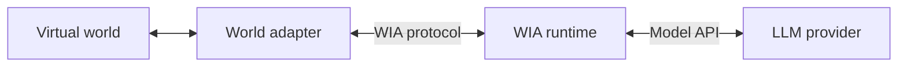

# World Is Agent

World Is Agent (WIA) is an experimental agent runtime for virtual worlds.

It connects real game worlds to LLM-driven agents through a protocol-first Runtime / Adapter architecture. Stardew Valley is the first real adapter and validation environment.

## Why WIA Exists

Virtual worlds already have identity, time, places, entities, rules, and consequences. WIA provides a reusable runtime layer that lets those worlds host AI agents with scoped identity, memory, context, tools, traces, and turn lifecycle management.

The goal is a game-native agent harness that can grow across different worlds while each adapter keeps ownership of its own game API, UI, threading model, and execution rules.

## Architecture



The core boundary is small:

- Agent owns intent.
- Runtime owns cognition.
- Protocol owns contracts.
- Adapter owns translation.
- Game owns execution.

Read [ARCHITECTURE.md](ARCHITECTURE.md) for the stable architecture overview.

## Current Status

WIA is in MVP0 active development. The currently validated path is the Go Runtime with the Stardew Valley SMAPI adapter.

Implemented today:

- gRPC bidirectional Runtime / Adapter stream.
- Protocol v1alpha2.
- Agent identity scoped by `game_id + world_id + entity_id`.
- Bounded multi-step AgentTurn execution.
- SQLite-backed Recent Memory scoped by game, world, and entity, with bounded context projection.
- Dynamic Capability to Tool registration.
- Sync and async action lifecycle.
- Provider-neutral model interface with Fake, DeepSeek, and OpenAI providers.
- Stardew dialogue, player input, emote, face-player, and same-location `move_to` validation.
- JSONL turn trace at `runtime/.local/traces.jsonl`.

Recent Memory defaults to 100 retained records per entity; model context includes at most 5 records within a 4096 estimated-token budget. Store/Loop reconstruction tests and real dialogue persistence are covered; live Runtime process-restart validation remains open. Full terminal history, summaries, history retrieval, and optional retention are planned in Phase8.2/8.3.

Current limits include process-local active turns and async waits, manual adapter installation, one real adapter, alpha protocol contracts, and no validated automatic environment recovery path yet.

Read [docs/STATUS.md](docs/STATUS.md) for the current capability matrix.

## Quick Start

Prerequisites:

- Go.
- .NET SDK.
- Stardew Valley with SMAPI installed.
- An LLM API key for the configured provider.

Start the Runtime:

```powershell
cd world-is-agent
$env:DEEPSEEK_API_KEY="..."
$env:GAMEAGENT_AGENT_CONFIG="runtime/config/games/stardew-valley/agent.json"
go run ./runtime/cmd/server
```

Build the Stardew adapter:

```powershell
$gamePath = "D:\SteamLibrary\steamapps\common\Stardew Valley"
dotnet build adapters/stardew/GameAgent.Stardew.csproj `
  --configuration Debug `
  -p:GamePath="$gamePath"
```

Install the adapter into the Stardew `Mods` directory, launch through SMAPI, load a save, and interact with a reachable NPC.

For the full Stardew flow, see [adapters/stardew/README.md](adapters/stardew/README.md).

## Configuration

- `runtime/config/model.json` configures provider, model, base URL, and API key environment references.
- `GAMEAGENT_MODEL_CONFIG` overrides the model config path.
- `runtime/config/agent.json` configures turn timeout, model timeout, memory limits, and tool budgets.
- `runtime/config/games/stardew-valley/agent.json` enables the Stardew runtime profile and static definition catalog.
- `GAMEAGENT_AGENT_CONFIG` overrides the agent config path.

Use environment variable references such as `env:DEEPSEEK_API_KEY` for real API keys.

## Repository Layout

```text
runtime/     Go agent runtime, gateway, loop, scheduler, memory, trace
protocol/    Protobuf contract and generated Go/C# bindings
adapters/    Game-specific adapters; Stardew is the first real adapter
docs/        Status, development guides, architecture notes, ADRs, phase plans
scripts/     Local checks and Stardew adapter install helper
```

## Development

Common checks are documented in [docs/development/testing.md](docs/development/testing.md).

```powershell
go test ./runtime/... ./protocol/gen/go/...
powershell -ExecutionPolicy Bypass -File protocol/tests/check-protocol-static.ps1
powershell -ExecutionPolicy Bypass -File protocol/tests/check-go-generation.ps1
dotnet test adapters/stardew/tests/ProtocolMapper.Tests/ProtocolMapper.Tests.csproj
dotnet test adapters/stardew/tests/ActionCancellationRegistry.Tests/ActionCancellationRegistry.Tests.csproj
dotnet test adapters/stardew/tests/PlayerInteractProbe.Tests/PlayerInteractProbe.Tests.csproj
dotnet build adapters/stardew/GameAgent.Stardew.csproj
```

Public documentation entry points:

- [ARCHITECTURE.md](ARCHITECTURE.md)
- [docs/STATUS.md](docs/STATUS.md)
- [ROADMAP.md](ROADMAP.md)
- [CONTRIBUTING.md](CONTRIBUTING.md)
- [docs/README.md](docs/README.md)

## License

MIT. See [LICENSE](LICENSE).
